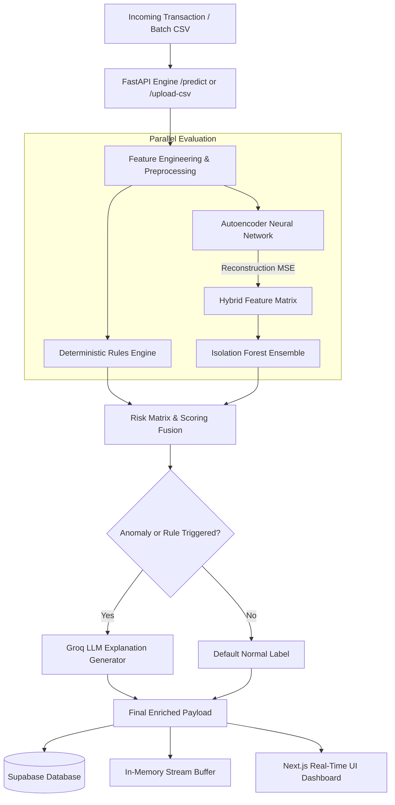
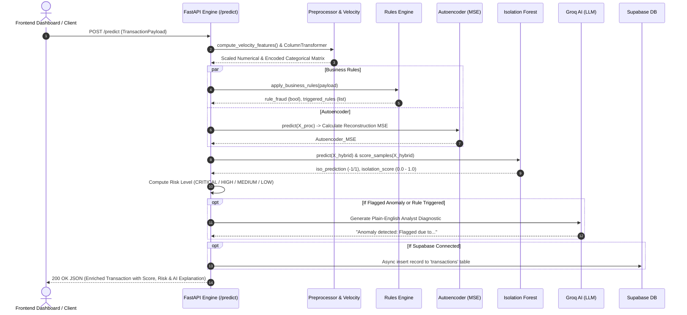

# 🛡️ Real-Time Fraud Triage Engine: Model, Rules & API Documentation

This document provides a comprehensive technical overview of the **Real-Time Fraud Triage Engine**, detailing the machine learning architecture, feature engineering, deterministic rules engine, mathematical evaluation metrics (Silhouette Score, Contamination Rate, Isolation Score), and the FastAPI backend architecture.

---

## 📑 Table of Contents
1. [System Overview & High-Level Architecture](#1-system-overview--high-level-architecture)
2. [Hybrid Machine Learning Model Architecture](#2-hybrid-machine-learning-model-architecture)
   - [Deep Symmetric Autoencoder (Non-Linear Manifold Learning)](#21-deep-symmetric-autoencoder)
   - [Isolation Forest on Hybrid Feature Space](#22-isolation-forest-on-hybrid-space)
   - [How Anomalies Are Detected](#23-how-anomalies-are-detected)
3. [Features & Feature Engineering Pipeline](#3-features--feature-engineering-pipeline)
4. [Deterministic Rules Engine](#4-deterministic-rules-engine)
5. [Key Metrics & Parameters: Contamination Rate, ISO Score & Evaluation](#5-key-metrics--parameters-contamination-rate-iso-score--evaluation)
   - [Contamination Rate & Dynamic Threshold Recalibration](#51-contamination-rate--dynamic-recalibration)
   - [Isolation Score (ISO Score) & Thresholding](#52-isolation-score-iso-score--thresholding)
   - [Silhouette Separability Score](#53-silhouette-separability-score)
   - [Multi-Tier Risk Classification Framework](#54-multi-tier-risk-classification-framework)
6. [FastAPI Backend Architecture & Request Lifecycle](#6-fastapi-backend-architecture--request-lifecycle)
   - [Application Lifespan & In-Memory Artifacts](#61-application-lifespan--in-memory-artifacts)
   - [End-to-End Request/Response Pipeline](#62-end-to-end-requestresponse-pipeline)
   - [API Endpoints Reference](#63-api-endpoints-reference)
   - [Groq AI Explanation & Supabase Synchronization](#64-groq-ai-explanation--supabase-synchronization)

---

## 1. System Overview & High-Level Architecture

The Fraud Triage Engine is an enterprise-grade, **hybrid unsupervised fraud detection system** designed to protect banking transactions in real-time. Because financial fraud is rare (<1%) and constantly evolving, traditional supervised models suffer from severe class imbalance and label latency. 

To overcome this, the engine combines:
1. **Deterministic Business Rules**: Immediate, zero-latency detection of hard-limit violations (e.g. brute-force login attempts, massive balance drains).
2. **Deep Autoencoder (Neural Network)**: Compresses transactions into a 16-dimensional bottleneck and calculates reconstruction Mean Squared Error ($\text{MSE}$).
3. **Isolation Forest**: Builds an ensemble of 150 isolation trees over a **hybrid feature space** (preprocessed features + Autoencoder $\text{MSE}$).
4. **Generative AI Diagnostics (Groq LLM)**: Converts mathematical anomaly scores into human-readable triage reports for bank analysts.
5. **FastAPI Engine**: Asynchronous microservice providing sub-millisecond scoring, batch CSV processing, dynamic threshold tuning, and live dashboard communication.



---

## 2. Hybrid Machine Learning Model Architecture

### 2.1. Deep Symmetric Autoencoder
The Autoencoder is implemented using an `MLPRegressor` configured with a symmetrical hourglass topology:
$$\text{Input } (D) \longrightarrow 64 \longrightarrow 32 \longrightarrow \mathbf{16 \text{ (Latent Bottleneck)}} \longrightarrow 32 \longrightarrow 64 \longrightarrow \text{Output } (D)$$

* **Loss Function**: Mean Squared Error ($\text{MSE}$) between original feature vector $X$ and reconstructed vector $\hat{X}$.
* **Activation**: Rectified Linear Unit ($\text{ReLU}$).
* **Optimizer**: Adam ($\alpha=10^{-4}$, initial learning rate $\eta=0.001$, batch size 64).
* **Role**: Normal transactions follow regular distributions and are reconstructed with near-zero error. Anomalous transactions (unusual amounts, atypical times, rapid velocity) deviate from learned patterns, yielding large reconstruction errors ($\text{MSE} = \frac{1}{D}\sum_{i=1}^D (x_i - \hat{x}_i)^2$).

### 2.2. Isolation Forest on Hybrid Space
Instead of feeding only raw features to the Isolation Forest, the engine constructs a **Hybrid Feature Matrix**:
$$X_{\text{hybrid}} = \left[ X_{\text{processed}} \quad \Big| \quad \text{Reconstruction\_MSE} \right]$$

* **Estimators**: 150 randomized decision trees.
* **Contamination Rate**: Configurable (default `0.01` to `0.03`).
* **Mechanism**: Partitions data by randomly selecting a feature and a split value. Anomalies have extreme attribute values or elevated reconstruction error, requiring significantly fewer splits (shorter tree path lengths) to isolate from normal data points.

### 2.3. How Anomalies Are Detected
1. **Feature Transformation**: Input features are scaled and one-hot encoded.
2. **Latent Reconstruction**: The Autoencoder projects features through the 16-D bottleneck and measures reconstruction fidelity ($\text{MSE}$).
3. **Hybrid Path Traversal**: The 150 Isolation Trees evaluate the combined feature vector + $\text{MSE}$.
4. **Score Computation**: Raw path length anomaly scores are extracted via `-iso_forest.score_samples(X_hybrid)` and normalized into the $[0.0, 1.0]$ range.

---

## 3. Features & Feature Engineering Pipeline

The system processes 14+ distinct raw and engineered attributes via a `ColumnTransformer` with `StandardScaler` and `OneHotEncoder(handle_unknown='ignore')`.

| Feature Name | Type | Extraction / Computation Method | Fraud Detection Significance |
| :--- | :--- | :--- | :--- |
| `TransactionAmount` | Numeric (Scaled) | Raw numeric value | Detects sudden high-value transactions |
| `AccountBalance` | Numeric (Scaled) | Raw numeric balance | Provides context for the transaction magnitude |
| `PercentBalance` / `AmountBalance` | Numeric (Scaled) | $\frac{\text{TransactionAmount}}{\text{AccountBalance} + 10^{-5}}$ | Identifies aggressive account draining (e.g. >90% balance) |
| `Txn_Count_12H` | Numeric (Velocity) | Rolling 12-hour window transaction count grouped by `AccountID` | Detects automated bot attacks, card testing, and transaction flooding |
| `Txn_Sum_24H` | Numeric (Velocity) | Rolling 24-hour cumulative spend grouped by `AccountID` | Catches cumulative balance depletion across multiple smaller transactions |
| `LoginAttempts` | Numeric (Scaled) | Raw counter | Flags brute-force password cracking / credential stuffing |
| `TransactionDuration` | Numeric (Scaled) | Seconds spent in checkout / session | Identifies inhumanly fast checkouts (scripts) or abnormal stalls |
| `Hour` | Numeric (Scaled) | Extracted from `TransactionTime` / `TransactionDate` ($0-23$) | Identifies off-peak / midnight account takeovers |
| `DayOfWeek` | Numeric (Scaled) | Extracted from `TransactionDate` ($0-6$) | Detects weekend vs. weekday spending shifts |
| `TransactionPreviousDifferenceDays` | Numeric (Scaled) | Days since last recorded transaction | Identifies dormant accounts suddenly reactivated |
| `CustomerAge` | Numeric (Scaled) | Raw demographic integer | Normalizes baseline behavioral expectations |
| `TransactionType` | Categorical (OHE) | `Payment`, `Transfer`, `Withdrawal`, `Debit` | Differentiates low-risk POS debit from high-risk wire transfers |
| `Channel` | Categorical (OHE) | `Online`, `ATM`, `Branch`, `Mobile` | Uncovers channel mismatch (e.g. sudden overseas online charge) |
| `CustomerOccupation` | Categorical (OHE) | `Engineer`, `Doctor`, `Retail`, `Retired`, etc. | Contextualizes spending power and behavioral variance |
| `Location` | Categorical (OHE) | Geographic city / region string | Flags geographic anomalies and impossible velocity |

---

## 4. Deterministic Rules Engine

In financial security, machine learning models should not act alone. A **Deterministic Rules Engine** (`apply_business_rules()`) executes prior to ML scoring to catch obvious, non-negotiable security violations instantly:

```python
def apply_business_rules(txn: dict) -> tuple[bool, list]:
    triggered_rules = []
    # 1. Excessive Login Attempts (Brute-force / Credential Stuffing)
    if txn.get("LoginAttempts", 0) >= 5.0:
        triggered_rules.append(f"Excessive login attempts ({int(txn['LoginAttempts'])} attempts)")
        
    # 2. Velocity Surge (Flooding / Scripted Attacks)
    if txn.get("Txn_Count_12H", 0) >= 15.0:
        triggered_rules.append(f"High 12H transaction velocity ({int(txn['Txn_Count_12H'])} txns)")
        
    # 3. Account Drain Wire Transfer
    if (txn.get("TransactionType", "").lower() == "transfer" 
        and txn.get("TransactionAmount", 0) > (txn.get("AccountBalance", 0) * 0.90) 
        and txn.get("TransactionAmount", 0) > 10000):
        triggered_rules.append(f"High-value transfer (${txn['TransactionAmount']:,.2f}) draining >90% of balance")

    # 4. Extreme Amount Hard Ceiling
    if txn.get("TransactionAmount", 0) > 50000:
        triggered_rules.append(f"Extreme transaction amount alert (${txn['TransactionAmount']:,.2f})")

    return len(triggered_rules) > 0, triggered_rules
```

### Why Rules + ML Work Together
* **Rules** guarantee 100% catch rate on predefined threat signatures with zero training delay.
* **ML (Autoencoder + Isolation Forest)** detects subtle, complex, multi-dimensional fraud patterns that bypass rigid threshold rules.

---

## 5. Key Metrics & Parameters: Contamination Rate, ISO Score & Evaluation

### 5.1. Contamination Rate & Dynamic Recalibration
* **Definition**: The expected proportion of outliers / anomalies in the dataset (e.g. `0.01` = 1.0% operational fraud budget).
* **Operational Problem**: In production, changing the contamination rate normally requires retraining the Isolation Forest from scratch.
* **Dynamic Recalibration Solution (`calibrate_isolation_offset`)**:
  Instead of retraining, the system recalculates the internal decision boundary threshold (`offset_`) using empirical sample percentiles:
  $$\text{new\_offset} = \text{Percentile}\left(\text{scores}, 100 \times \text{contamination}\right)$$
  This allows risk teams to adjust fraud sensitivity via API endpoints (`POST /api/v1/model/set-contamination`) in real-time with zero downtime.

### 5.2. Isolation Score (ISO Score) & Thresholding
* **Raw Isolation Score**: Path length average across 150 trees. In scikit-learn, `-score_samples(X)` outputs higher values for anomalies.
* **Normalized ISO Score**:
  $$\text{Normalized Score} = \frac{\text{Raw Score} - \text{Raw Score}_{\min}}{\text{Raw Score}_{\max} - \text{Raw Score}_{\min} + 10^{-7}} \in [0.0, 1.0]$$
* **Default Threshold (`ISO_SCORE_THRESHOLD = 0.55`)**:
  * Score $< 0.40$: Normal baseline traffic
  * $0.40 \le$ Score $< 0.55$: Moderate deviation (MEDIUM)
  * $0.55 \le$ Score $< 0.70$: High anomaly likelihood (HIGH)
  * Score $\ge 0.70$ or Rule Triggered: Critical threat (CRITICAL)

### 5.3. Silhouette Separability Score
In unsupervised learning without true labels, how do we prove the model is finding real anomalies rather than random noise?
* **Silhouette Score Formula**:
  $$s(i) = \frac{b(i) - a(i)}{\max(a(i), b(i))}$$
  where $a(i)$ is mean intra-cluster distance, and $b(i)$ is mean nearest-cluster distance.
* **Measured Benchmark**: **`0.5915`** on financial transaction data.
* **Significance**: Proves strong geometric separation—normal transactions form a dense, cohesive core cluster, while flagged anomalies are pushed far into the high-dimensional periphery.

### 5.4. Multi-Tier Risk Classification Framework

```
                          [ Transaction Evaluated ]
                                      |
         +----------------------------+----------------------------+
         |                                                         |
[ Rule Triggered? OR ISO Score >= 0.70? ]              [ ISO Score >= 0.55? OR Iso/AE Anomaly? ]
         | YES                                                     | YES
    [ CRITICAL ]                                               [ HIGH ]
                                                                   | NO
                                                       [ ISO Score >= 0.40? ]
                                                                   | YES
                                                              [ MEDIUM ]
                                                                   | NO
                                                               [ LOW ]
```

---

## 6. FastAPI Backend Architecture & Request Lifecycle

### 6.1. Application Lifespan & In-Memory Artifacts
FastAPI utilizes an `@asynccontextmanager` lifespan handler:
1. **Startup**: Loads `preprocessor.joblib`, `autoencoder_model.joblib`, and `isolation_forest_model.joblib` from disk or MLflow into memory (`ml_artifacts`).
2. **Offset Calibration**: Automatically calibrates `offset_` using `CONTAMINATION_RATE`.
3. **Database & AI Clients**: Initializes asynchronous Groq LLM and Supabase PostgreSQL client connections.
4. **Data Seeding**: Seeds initial transaction state for instant dashboard responsiveness.
5. **Shutdown**: Gracefully cleans up model memory.

### 6.2. End-to-End Request/Response Pipeline



---

### 6.3. API Endpoints Reference

| Method | Route | Description | Request Body / Query | Key Response Attributes |
| :--- | :--- | :--- | :--- | :--- |
| `GET` | `/` | System health check & status | None | `status`, `models_loaded`, `groq_enabled`, `supabase_connected` |
| `GET` | `/metrics` | Production mathematical metrics | None | `silhouette_score` (`0.5915`), `contamination_rate_mean`, `models` |
| `GET` | `/history` | Fetch recent transactions for dashboard | None | Array of recent evaluated transaction objects |
| `POST` | `/predict` | Real-time single transaction triage | `TransactionPayload` (JSON) | `is_fraud`, `risk_level`, `isolation_score`, `autoencoder_mse`, `ai_explanation` |
| `POST` | `/upload-csv` | Batch CSV anomaly processing | Multi-part form (`file`: CSV) | `total_processed`, `flagged_fraud`, `critical_count`, `high_count`, `data` |
| `POST` | `/simulate` | Injects synthetic/sampled transactions | `?count=5` (default 5) | `status`, `simulated_count`, `flagged`, `latest` |
| `DELETE` | `/history` | Clears in-memory recent transactions | None | `{"status": "cleared"}` |
| `GET` | `/api/v1/model/contamination` | Inspects current sensitivity parameters | None | `configured_contamination_rate`, `iso_score_threshold`, `isolation_forest_offset` |
| `POST` | `/api/v1/model/set-contamination` | Dynamically updates sensitivity & offset | `?contamination=0.01&score_threshold=0.55` | `new_contamination_rate`, `new_iso_score_threshold`, `new_offset_threshold` |

---

### 6.4. Groq AI Explanation & Supabase Synchronization

* **Groq LLM Diagnostic Engine**:
  When a transaction is flagged by a rule or receives an anomaly score $\ge 0.50$, the system constructs a context prompt detailing transaction velocity, login attempts, amount vs. balance, and safety rule violations. Groq's model synthesizes this into an actionable 1-2 sentence explanation formatted as:
  > *"Anomaly detected: Flagged due to excessive login attempts (6 attempts) and unusual transaction amount ($18,500.00) draining >90% of account balance."*

* **Supabase Live Synchronization**:
  Evaluated records are automatically formatted via `format_for_supabase()` and persisted to the PostgreSQL `transactions` table, enabling persistent audit trails and real-time dashboard subscriptions.

---

## 7. Summary & Quick Reference

* **Model Type**: Hybrid Unsupervised (Deep Autoencoder + Isolation Forest).
* **Key Strengths**: Zero dependence on labeled historical fraud, sub-millisecond scoring latency, mathematical validation via Silhouette Score ($0.5915$), and real-time dynamic contamination recalibration without model downtime.
* **FastAPI Server**: Coordinates data preprocessing, rules evaluation, neural network reconstruction, tree-based isolation, LLM explanation generation, and database sync into a single unified API pipeline.
